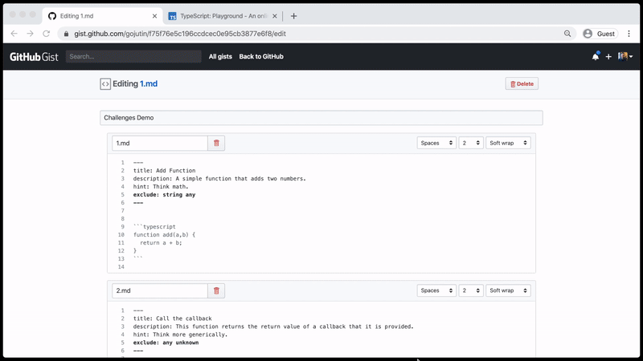

# playground-plugin-challenges

**Turn your Gists into interactive coding challenges in the TypeScript Playground.**



Created with the [typescript-playground-plugin-react](https://github.com/gojutin/typescript-playground-plugin-react) template.

## How To Create Your Own Challenges

Sign in to GitHub and go to `https://gist.github.com/YOUR_USER_NAME`.

Click the `+` icon in the upper right hand corner to create a new Gist.

 The *Gist Description* will be the name of your challenge project.

 From here, you will create a markdown file (`.md`) for each challenge item that you would like to create. The name of the file does not matter other than the `.md` extension.

Each markdown file should consist of three parts:
1. Front Matter (optional metadata)
2. Starting Code Block (problem code)
3. Ending Code Block (solution code)

### **Front Matter**

Front matter is metadata that you can provide to each challenge item to change the UI or behavior. 

The options are as follows:

| Name | Description|
|--|--|
|`title` |The title of the challenge item. Defaults to `Challenge #1`. |
|`description`|A description of the challenge item displayed below the title.|
|`hint`|If you provide a hint, a button will be displayed that allows the user to reveal the hint.|
|`exclude`|A list of TypeScript types that the user is not allowed to use.  |

**Example** 

```
---
title: Add Function
description: A simple function that adds two numbers.
hint: Think math.
exclude: string any
---
```

### **Starting Code**
Next, you will supply the starting code by using a code block (triple backticks).

This code should be written like JavaScript and not contain any TypeScript annotations. 

It will be the user's job to add the necessary TypeScript code to make the errors go away. 

**Example** 

````` 
```
function add(a,b) {
  return a + b;
}
```
`````

### **Ending Code**
This represents the corrected version of the starting code and should not result in any errors. 

The user will be presented with a `Show Solution` button. Once clicked, the editor code will be replaced with the ending code, which should cause all errors to be resolved.

Errors can result from one of three things:
1. TypeScript compile errors
2. Errors resulting from using types in the excluded list defined in the front matter.
3. Any changes that deviate from the starting code.

If this ending code results in errors, the user won't be able to progress to the next question. It is recommended to double check your code each time with the plugin to ensure that there aren't errors in the ending code.

**Example** 

````` 
```
function add(a: number,b: number) {
  return a + b;
}
```
`````

### **Full Example**

`````
---
title: Add Function
description: A simple function that adds two numbers.
hint: Think math.
exclude: string any
---

```
function add(a,b) {
  return a + b;
}
```

```
function add(a: number,b: number) {
  return a + b;
}
```
`````

## Just Remember

- It's one Gist per Challenge group and one markdown file per challenge item.
- Each markdown file consists of 3 parts: **front matter**, **starting code block**, and **ending code block**.
- Front matter is optional. The starting and ending code blocks are not.
- The ending code is only used to show the user one possible solution. Their code is checked against the compiler errors and compiled source code. This means that their solution does **not** have to match your solution. It just has to pass the compiler check, front matter exclusion types, and match the original source once compiled.